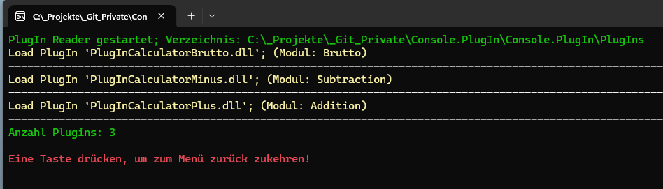
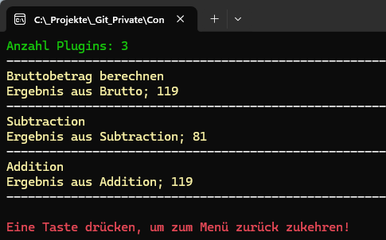

# Console.PlugIn


## Projekt zur Demonstration einer PlugIn Funktionen in .NET 10
Das Konsolenprogramm dient zur Demonstration einer PlugIn-Funktionalität mit dem erweiterten `FileSystemWatcher` aus dem Projekt [BuffertFileSystemWatcher](https://github.com/GerhardAhrens/Console.FileSystemWatcher).

Es können PlugIns direkt aus einem Verzeichnis, oder als Hot-PlugIn zur Laufzeit hinzugefügt werden. Es können auch mehrere PlugIns hintereinander geladen werden.

## Hinweis
Der Source soll auch einfache Art und Weise die Funktionen eines Features zeigen. Der Source ist so geschrieben, das so wenig wie möglich zusätzliche NuGet-Pakete benötigt werden.

## Beispielsource

Nach dem Starten des Programms wird die Möglichkeit gegeben, ein PlugIn zu laden. Es können auch mehrere PlugIns hintereinander geladen werden. Es können auch PlugIns zur Laufzeit hinzugefügt werden.



```csharp
IEnumerable<string> plugIns = MultiEnumerateFiles(PlugInPath, "*.dll");
if (plugIns != null)
{
    foreach (string file in plugIns.AsParallel())
    {
        Assembly assembly = AssemblyLoadContext.Default.LoadFromAssemblyPath(file);
        if (assembly != null)
        {
            var types = assembly.GetTypes().Where(t => typeof(IPlugIn).IsAssignableFrom(t) && t.IsInterface == false);

            foreach (Type type in types.AsParallel())
            {
                if (type.IsAbstract == false)
                {
                    if (Activator.CreateInstance(type) is IPlugIn plugin)
                    {
                        Plugins.Add(plugin);
                    }
                }
            }
        }
    }
}

```

Über das Interface `IPlugIn` können die Funktionen der PlugIns aufgerufen werden. In diesem Beispiel wird die Funktion `Execute` aufgerufen, die z.B. das Ergebnis einer Berechnung zurückgibt, die dann auf der Konsole ausgegeben wird.

```csharp
if (Plugins.Count > 0)
{
    Console.WriteText($"Anzahl Plugins: {CountPlugIns()}", ConsoleColor.Green);
    Console.Line('-');
    foreach (IPlugIn plugin in Plugins)
    {
        decimal result = plugin.Calculate(100,19);
        Console.WriteText(plugin.ShortDescription, ConsoleColor.Yellow);
        Console.WriteText($"Ergebnis aus {plugin.Modul}; {result.ToString("#,00", CultureInfo.CurrentCulture)}", ConsoleColor.Yellow);
        Console.Line('-');
    }
}
```



# Versionshistorie


- Migration auf NET 10
